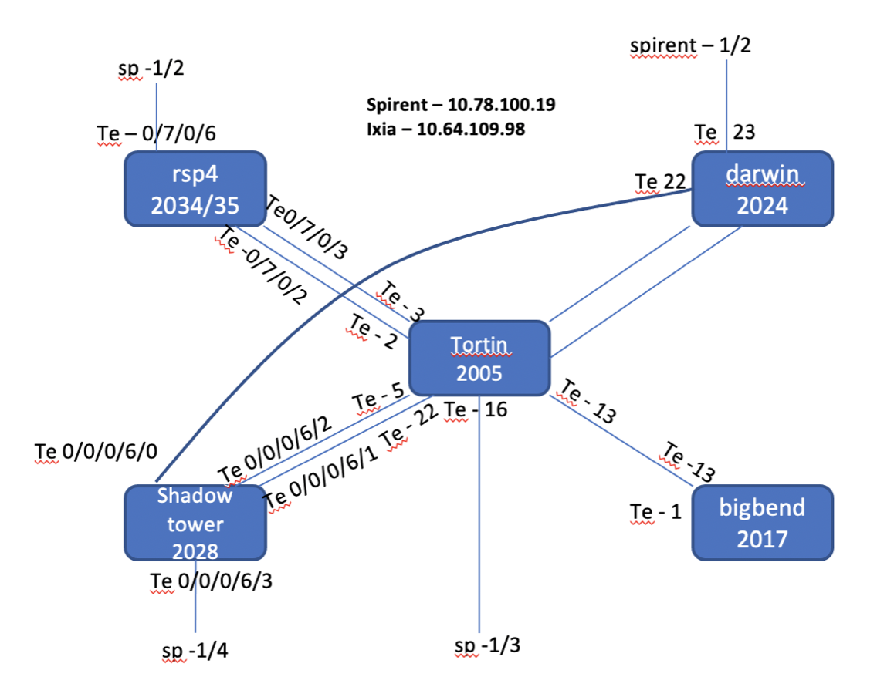

# Show Topology

>Created with :heart: by **Akshay Mittal** in India :india:

## Acknowledgement

I would like to thank **Rohit Kumar Gupta (rohigupt)**, who sowed the seed in my mind to take this up. He has constantly helped with wonderful ideas and comments for this project. Also, I would like to thank **Bhaskar Bhumkar (bbhumkar)**, my manager, for giving it due importance and equipping me with the necessary time and resources.

## Why? (Problem statement)

- ### Static topology diagrams

Teams have a certain set of routers and their topologies. The topology diagrams are **maintained manually**.

For example:

 

- These diagrams are **difficult to update** being in image format and can usually be done by someone who first created it as he/she will have the image in editable format.

- We tend to spend a **lot of cycles in maintaining these diagrams** whenever a simple connection change has been done.

- The data may go **obsolete** due to obvious reasons.

- These topology diagrams are independent of one another. Since, the connections are made by many engineers, there is a high probability of **connections being present across topologies and not being documented**.

- ### Router state

These diagrams show **no information about the state of the routers**.

- It creates a lot of frustration and wastes cycle when we realise that some routers for which we already built images to flash, are not in usable state. This can be due to power supply issues, hardware issues, telnet line issues or any other.

- No place to identify all routers in bad state at one shot, hence, we end up raising different lab cases at different time.

## What? (Proposed solution)

**Dynamically generate topology diagram** by identifying physical links between the routers.

## How? (Approach)

- **LLDP** (Link Layer Discovery Protocol) is configured on all the routers.

- Once LLDP neighbourship has been established, LLDP neighborship information is collected from all the routers.

- This information is then processed and fed into a web app based on nextUI framework.

- The web app creates a topology diagram as shown below:


## Features

- Data to connect to the routers is fetched from a **shared excel sheet**, hence, easy to maintain and update input data by anyone.

- The tool explicitly **identifies nodes in "bad" state** and displays them as a separate icon (The black skull).

- **Separate icons** for nodes that have **TGEN connectivity** and for those that do not.

  - Rectangular icons with a star at botton right have TGEN connections.

    

  - Circular icons do not have TGEN connections.

    

- Routers are colour coded on the basis of their reservation status:

  - Red: Occupied
  - Yellow: ETA expired, hence, can be considered free.
  - Green: Free for use

  *The reservation status is maintained in the excel sheet.*

- Since, the reservation states are independent of connections and more volatile, a separate interface (in the form of a button) is provided.

    

  - This button enables **any user to update the reservation state** of the routers in real-time.
  - These updates are made on the server, hence, **persistent** across sessions and users.
  - A timestamp is maintained at the top of the page to display the time when the topology and reservation states were last updated.

- The routers are clickable and draggable as shown and shows useful information:

  

- The links are clickable and shows their connection information:

  

- All neighbors of a router can be identified by just a mouse hover:

  

  *Here, mouse is hovered over Bigbend_2020. Hence, all other nodes but the direct neighbors of Bigbend_2020 are dimmed down.*

- The tool **leverages multithreading** capabilities of the CPU to perform the jobs. Experimetally, it has been observed that, for 29 routers, the synchrnous version takes aroud 60 min, while, the asynchronus version (currrent) takes only about 8 min 30 sec.

## Installation

- Clone this repo

  `git clone https://cto-github.cisco.com/topology/show_topology.git`

- Create python virtual environment:

  `python3.8 -m venv venv`

  *Please use python>=3.8*
  > Different python versions can be found in /router/bin

- Install the required python libraries:

    `pip install -r requirements.txt`

- Install NodeJS dependencies:

    `npm install`

- Create new `settings.cfg` file in workspace root. The template has been specified in `settings_format.cfg` file. The username and password is the name that you use to access the excel sheet.

## Usage

### Backend

- Activate python virtual environment:

    ```source venv/bin/activate```

    *Terminal prompt should change and look something like ```(venv)<previous prompt>```*

- Backend Python scripts can be executed in following two ways:

  - Just execute one file and all internal functionalities willl be taken care of:
    ```python main.py```
  - Incase there is problem in the above script or you wish to run the script for various steps manually: ```python execs/<script name>```

    *Python files have been numbered according to their order of execution in execs/*

### Frontend

- Start the NodeJS HTTP server:

  ```node app.js```

- Open the browser app on your device and go to `http://<your_IP>:<port>`. For example, `http://64.104.150.240:9000`

## Technical Stack

### Backend (Python scripts)

#### Code Organisation

- Python executables are in `/execs`, numbered according to order of execution.
- `/utilities` consists of APIs developed. These are used by files in `/execs`.
- Any downloaded/generated files will be kept in `/tmp`.

#### Code flow

##### Topology generation

- The input file from the user is `settings.cfg`. This file specifies the URL of the excel sheet that holds the information about various routers. This file also contains the login credentials which are essential to download the excel file.

  > It is advised to set proper permissions of the `settings.cfg` for security reasons.
- Output file is `static/generated/topology.js` file. This file is used as input by frontend code base.

The following flow chart is self-explanatory:

  

##### Reservation database

- As stated earlier, reservation database is fetched independently to make the functionality independent of topology generation.
- The input file is same i.e., `settings.cfg`. This is used to download the excel sheet.
- The output file, `static/generated/node_reservation.js`, is used as input by frontend code base.

The following flow chart is self-explanatory:

  

### Frontend (JS, NodeJS, CSS, HTML)

#### Code organisation

- `static` contains files which will be sent to the client and used by client's browser app to render the content.
- `static/generated` contains the files generated by backend code base. These will be used to render the contents on client's browser.
- `app.js` is used to host NodeJS server. This is used to listen to connection requests from the client and serve them.
- `package.json` contains information about the NodeJS application.

> **It is highly unlikely that any changes will be required in `package.json`. Please think twice.**

#### Code Flow

##### View topology

When the user enters the appropriate URL in the browser:

  

##### Update reservation states

 When the user clicks on the "update reservation" button:

  

Please note that this is a synchronous activity and the user has to wait until the reservation database is updated. This usually takes ~3 sec.

## Further enhancements

Enhancements can be limitless. I have documented some I could think of:

- [ ] Add support for various protocol connections to the router, example, `ssh`.
- [ ] It has been observed that if someone clears the telnet line while the backend code is running, the corresponding router's information is not received, which is quite obvious. We can try to minimise such issues with following:

  - Try to clear line again and reconnect and carry on with the script, if the router is in expected state.
  - If `ssh` support is enabled, change router's login credentials via `telnet`. Then, login via `ssh`, now, if someone clears line, we are good. Also, since credentials have changed, no change could be made to the router's state.

- [ ] For HA devices, if the standby console details are provided but the console/RP is not in bad state, the script assumes router to be in bad state. This is the behaviour from pyATS's connect API. We can work towards finding a way to handle this scenario. (May need to work with pyATS team)
  - As a workaround, if we already the know the problematic console in HA device, we can remove the port from testbed excel sheet and only have port 1 there. This way the script will assume it to be a non-HA device and won't fail.

> Here, we must keep in mind that port 1 column in excel sheet should never be empty. If it is the console port 1 that is in bad state, replace port 1 with port 2 and keep the cell in the column for port 2 vacant.

- [ ] We can add a feature to enable the backend scripts to be executed via a button (similar to update reservation button). However, this will call for better synchronisation and only "admin" must be allowed to do so. Hence, we can work towards implementing user accounts and priviledges in the app.

- [ ] Add support to dyamically identify TGEN interfaces instead of depending on static information from testbed excel sheet.

---
:heart: :india:
